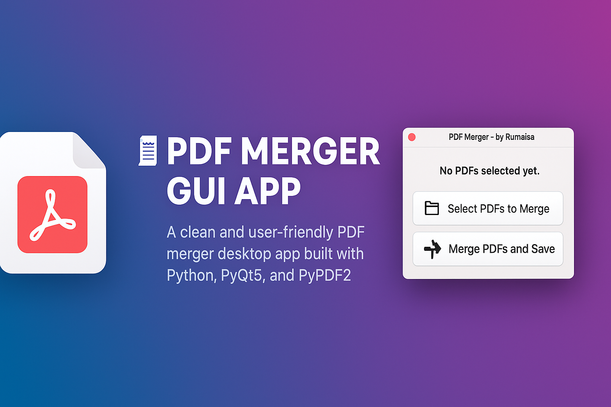

<p align="center">
  
</p>

<h1 align="center">🧾 PDF Merger GUI App</h1>

<p align="center">
  A clean and user-friendly PDF merger desktop app built with Python, PyQt5, and PyPDF2.<br/>
  Easily merge multiple PDF files with a simple graphical interface!
</p>

<p align="center">
  
  
  
  
</p>

---

## 💡 Features

- 📂 Select and arrange multiple PDF files
- ➕ Merge all selected PDFs into one file
- 💾 Save merged output anywhere on your computer
- 🖱️ Easy-to-use drag & browse interface
- ⚠️ Error handling for missing or invalid files
- 🧠 Beginner-friendly GUI project

---

## 🚀 Getting Started

### 1. Clone the Repository

```bash
git clone https://github.com/Rumaisas-islam/pdf-merger-gui.git
cd pdf-merger-gui
```

### 2. Install Dependencies

```bash
pip install -r requirements.txt
```

### 3. Run the Application

```bash
python pdf_merger_gui.py
```

---

## 📁 Project Structure

```
pdf-merger-gui/
├── banner.png                 # Banner image for README
├── LICENSE                    # MIT License
├── README.md                  # Project README
├── pdf_merger_gui.py          # Main Python GUI script (Tkinter)
├── requirements.txt           # Required dependencies
├── test/                      # Folder for test scripts
│   └── test_merger.py         # Test for merge functionality
└── .gitignore                 # Files to ignore in git
```

---

## 🛠️ Tech Stack

* Python 3.x
* PyQt5 (GUI)
* PyPDF2 (PDF handling)

---

## 📜 License

This project is licensed under the [MIT License](LICENSE).

---

## 🙋‍♀️ About the Author

Hi, I'm **Rumaisa**,

* 🎨 Illustrator turned Python Developer
* 💻 Passionate about GUI apps and creative coding
* 🇵🇰 From Pakistan | 🤖 Dreaming of building AI apps soon, InshaAllah!

If you like this project, give it a ⭐ on GitHub and share it with others!
